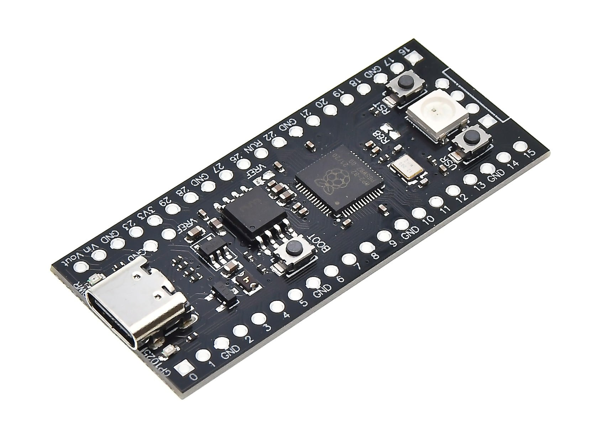
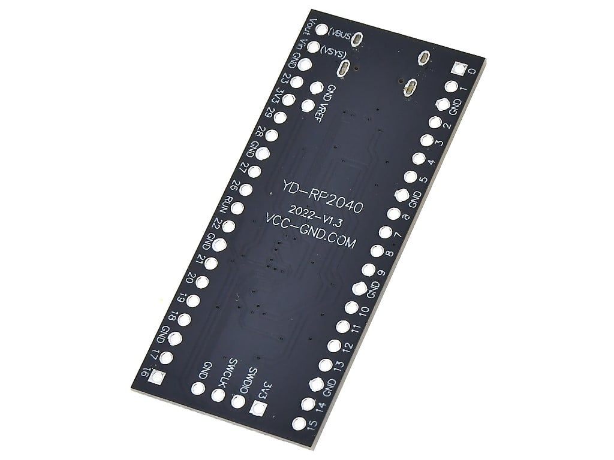
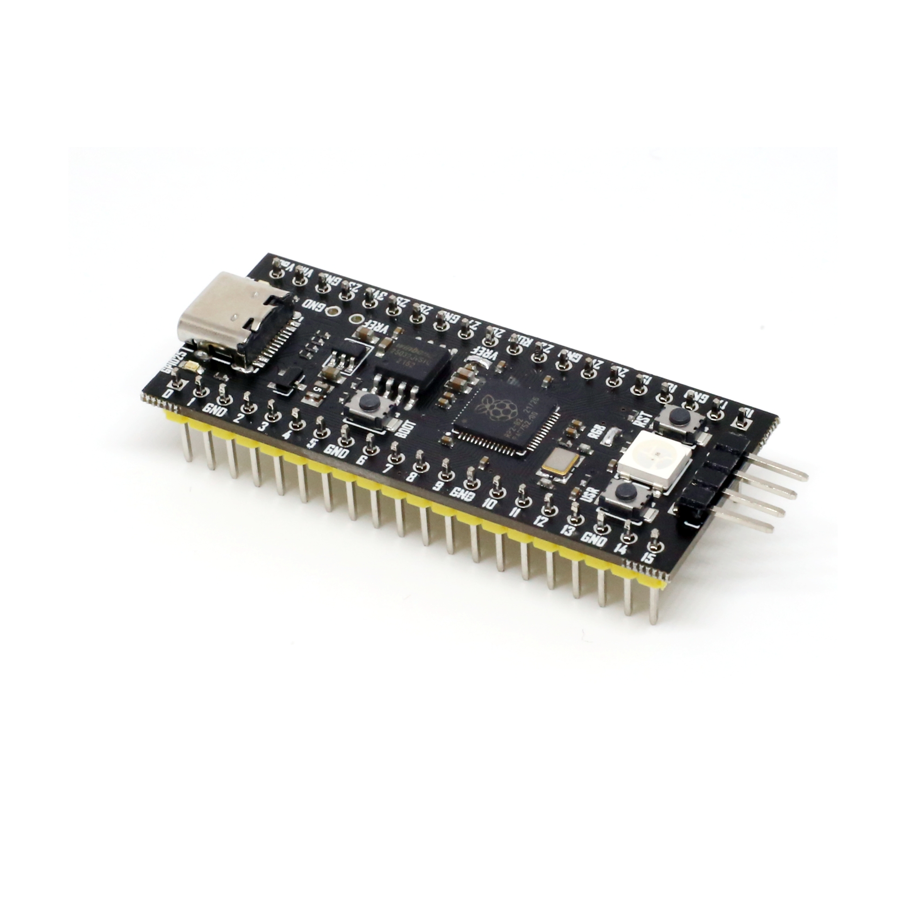

# YD-RP2040

> An unofficial repo collecting its data.

## Main view

<!--  -->

## Pinout

## Known issues

1. **Pinout `RGB` not connected:**  so on-board WS2812B won't able lighting up unless you welding it.

2. **`VREF` not connected to `3V3`:**  so you won't able to get correct value from `ADC` pins. ([#1](https://github.com/initdc/YD-RP2040/issues/1))

    You can try connecting them directly, or add [a 200 ~ 220 ohm resistor](img/IMG20251202145111-attr.jpg) for them like the official Pico 1 SCH did. 
    
    Or just welding [the middle `VREF` pinout](img/tb_image_share_.jpg.png), but I am not sure there is connected with a resistor or not.

## License

CC-BY-SA
